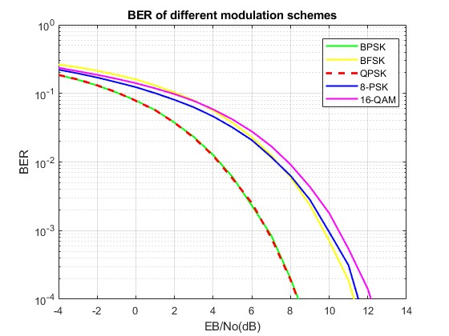
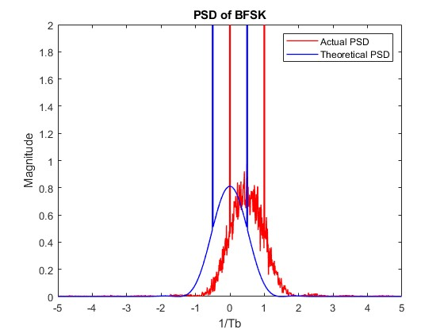
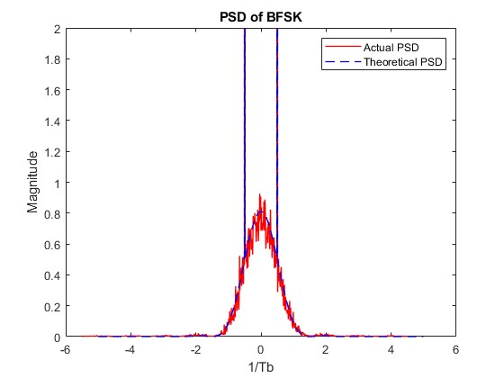

# Digital Communication Systems

This repository contains MATLAB code for simulating and analyzing various digital communication systems.

# Table of Contents
  - [Project 1: Digital Line Coding Analysis: Statistical Perspectives](#project-1-digital-line-coding-analysis-statistical-perspectives)
    - [Description](#description)
    - [Code](#code)
  - [Project 2: Simulation and Analysis of BER Performance for Various Digital Modulation Schemes](#project-2-simulation-and-analysis-of-ber-performance-for-various-digital-modulation-schemes)
    - [Description](#description-1)
    - [Code](#code-1)
    - [Some of the results obtained](#some-of-the-results-obtained)
  - [Project 3: OFDM System Simulation](#project-3-ofdm-system-simulation)
    - [Description](#description-1)
    - [Code](#code-2)
    - [Report](#project-report)

## Project 1: Digital Line Coding Analysis: Statistical Perspectives

### Description
In this project, a software radio transmitter is simulated using MATLAB. The transmitter's main function is to convert digital data into modulated waveforms for transmission over the air or through cables using line codes. Obtaining the statistics (Mean and Autocorrelation) and Power Spectral Density (PSD) of the following line codes:

- Unipolar Signaling
- Polar Non-Return to Zero (NRZ)
- Polar Return to Zero (RZ)
### Code 
> [Digital Line Coding Analysis project code](Line_Codes_Statistics/project_final.m)

## Project 2: Simulation and Analysis of BER Performance for Various Digital Modulation Schemes

### Description
This project aims to simulate a single carrier communication system using MATLAB to analyze the Bit Error Rate (BER) performance of different modulation schemes. We compare the simulated BER results with theoretical BER calculations for various modulation schemes:

- Binary Phase Shift Keying (BPSK)
- Quadrature Phase Shift Keying (QPSK), with comparison for gray and non-gray coding.
- 8-Phase Shift Keying (8PSK)
- 16-Quadrature Amplitude Modulation (16QAM)
- Binary Frequency Shift Keying (BFSK)
### Code
> [Simulation and Analysis of BER Performance for Various Digital Modulation Schemes project code](Digital_Modulation_Schemes/Modulation_Schemes_Project3.m)

### Some of the results obtained

| BER of Different Modulation Schemes             | QPSK BER with and without Gray Coding             |
|--------------------------------------------------|----------------------------------------------------|
|  |  |
| **PSD of BFSK**                                           | **PSD shifted of BFSK**                                            |
|  |   |

## Project 3: OFDM System Simulation

### Description
This project focuses on the simulation and analysis of Orthogonal Frequency Division Multiplexing (OFDM) systems using MATLAB. The project includes the following:

- **Implementation and Analysis of Transform Algorithms**
  - MATLAB implementation of Discrete Fourier Transform (DFT).
  - Performance testing of the implemented DFT and built-in FFT.
  - Comparison of execution times between DFT and FFT.

- **Bit Error Rate (BER) Performance Analysis**
  - BER for BPSK, QPSK, and 16-QAM over Rayleigh flat fading channel.

- **OFDM System Simulation**
  - BER analysis for QPSK and 16-QAM under different channel conditions:
    - Rayleigh flat fading channel
    - Frequency selective fading channel
  - Impact of rate 1/3 repetition coding on BER performance with same power per transmitted bit.

### Code
> [OFDM System Simulation and Analysis project code](OFDM)

### Project Report
> [OFDM System Simulation and Analysis project Report](OFDM/OFDM_Report.pdf)

